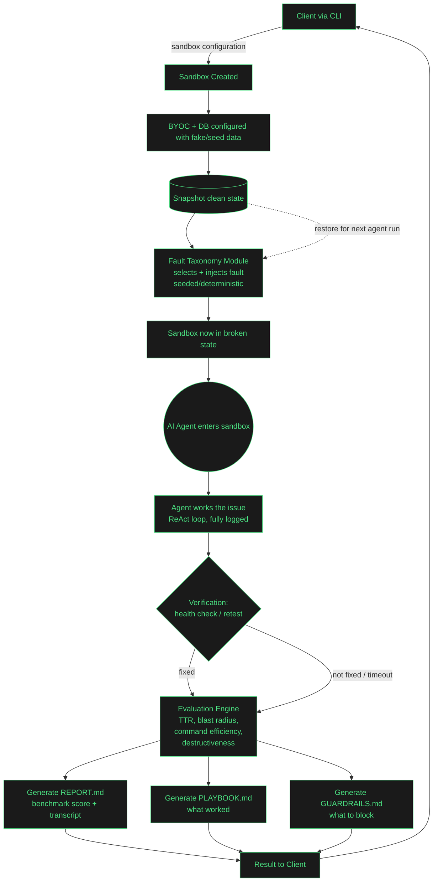

# SRElab AI — Revised Architecture Flow

This document captures the revised end-to-end flow for the sandbox → fault injection → AI agent → evaluation → report loop, based on the original whiteboard sketch plus proposed changes (evaluation engine, verification gate, and reproducibility via snapshots).

## Flow Diagram

## Notes on changes vs. original sketch

- **Snapshot node**: captures clean sandbox state right after BYOC+DB setup, before any fault is injected. Enables restoring identical conditions to replay the same fault against multiple agents for fair benchmarking.
- **Verification gate**: after the agent acts, the sandbox is re-tested (health check / retest of the original failing request) before scoring — prevents crediting an agent that merely *claims* to have fixed the issue.
- **Evaluation Engine**: sits between the agent's work and doc generation. Produces a multi-dimensional score (TTR, blast radius, command efficiency, destructiveness) regardless of whether the fix succeeded or timed out, so failures are still logged and comparable.
- **Three output artifacts** instead of two: `REPORT.md` (score + transcript, for auditability) alongside `PLAYBOOK.md` (what worked) and `GUARDRAILS.md` (what to block, derived from failed/destructive attempts).
- **Restore loop (dotted arrow)**: snapshot feeds back into fault injection, supporting repeatable runs against different agents/models for comparison.

## Open items / future extension

- Multi-agent comparison mode: same fault + snapshot restored, run in parallel against agent A/B/C, feeding into one comparison report.
- Fault severity tiers (tier 1 config typo → tier 3 cascading timeout + data corruption) to show competence curves rather than pass/fail.
- Dynamic fault taxonomy updates: human-reviewed postmortem patterns feeding back into the taxonomy module over time, similar to the Rulebook/RAG loop described in `readme.md`.
